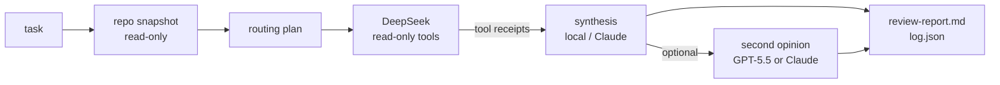

# agentctl

[](https://github.com/nzrbits/agentctl/actions/workflows/ci.yml)
[](LICENSE)

A small CLI that runs several coding agents on one task and keeps the result reproducible.

I use it every day in infrastructure and code work. It follows one rule: **a cheap model reads, a reliable model thinks.**
DeepSeek does the token-heavy part (reading files, grepping, dumping logs). Claude, or whoever owns the logic, only sees
the raw evidence DeepSeek collected and makes the decision from that. GPT-5.5 can add a second opinion, but a run never
waits for it.

Pure Python standard library, no dependencies. Runs on macOS, Python 3.9+.

## Why

Agent CLIs fail in boring ways. A model ends its turn after the tool calls without writing an answer, a subprocess
waits forever on stdin, a free API route returns exit 0 with an empty body. If the orchestrator trusts the model's
summary, each of these turns into a wrong "done".

agentctl treats the models as unreliable workers inside a deterministic shell:

- **Evidence over prose.** The worker's deliverable is not its summary. It is the list of tool calls it made, with
  input and output, parsed straight from the event stream. The summary is kept, marked as untrusted.
- **Timeouts that mean something.** Every agent has a hard timeout and an idle timeout. A stall gets one bounded retry,
  then the run moves on.
- **Optional means optional.** An empty review is marked `unavailable`. It never blocks a run and never counts as an
  accept.
- **Everything on disk.** Each run writes its prompts, raw output, parsed reports and a decision to `.agent-runs/<id>/`.

## How a run works



1. **Snapshot** the target repo: git state, file list, language, test command.
2. **Plan** the route. DeepSeek always goes first, the reviewer depends on `--route`.
3. **Retrieve.** DeepSeek runs via OpenCode with read-only tools.
4. **Harvest receipts** from its event stream, whether or not it wrote a final answer.
5. **Synthesize** the decision from the receipts.
6. **Review** (optional). A second model checks the synthesis against the same receipts.
7. **Persist** everything and print a short summary.

## Safety

- Read-only by default. `--allow-edit` puts agent edits into a separate git worktree, never the main working tree.
- Every command an agent reports is scanned for destructive patterns: `rm -rf`, `git reset --hard`, force push,
  `terraform apply`, `kubectl delete`, `helm uninstall`, cloud CLI mutations and more. Hits are flagged in the report.
- Receipts go to the reviewer as data. Its prompt tells it never to follow instructions found inside them.
- Rate limits, auth errors, billing and context overflow are classified from CLI output and surface as flags
  (`GPT_LIMIT_ACTIVE`, `BLOCKED — auth error`, …) instead of silent failures.
- API keys come from the environment or a gitignored `.env`. `doctor` prints them masked.

## Quickstart

Requirements: `git`, Python 3.9+, [OpenCode](https://opencode.ai) with a DeepSeek key, and optionally
[Claude Code](https://claude.com/claude-code).

```bash
git clone https://github.com/nzrbits/agentctl.git
ln -s "$PWD/agentctl/agentctl" ~/.local/bin/agentctl
mkdir -p ~/.config/opencode/agent && cp agentctl/.agent/opencode/deepseek-worker.md ~/.config/opencode/agent/

cd ~/code/some-repo
agentctl doctor
agentctl run "why does the nightly pipeline fail?" --dry-run
agentctl run "why does the nightly pipeline fail?"
agentctl review
```

Run it from inside the repo you want to work on. That repo is the context, and the run artifacts land in its
`.agent-runs/`.

## Commands

| Command | What it does |
|---|---|
| `agentctl` | interactive console (same as `agentctl shell`) |
| `agentctl doctor` | check git, toolchains, agent CLIs, config and env vars (masked) |
| `agentctl run "<task>"` | snapshot, DeepSeek retrieval, synthesis, optional review |
| `agentctl run "<task>" --dry-run` | write plan and prompts, run no agents |
| `agentctl run "<task>" --allow-edit` | allow edits, isolated in git worktrees |
| `agentctl run "<task>" --route <route>` | `deepseek` (default), `deepseek-claude`, `deepseek-gpt55`, `deepseek-chatgpt` |
| `agentctl ingest <run>` | add a reply pasted from ChatGPT to a run (for `deepseek-chatgpt`) |
| `agentctl status` | list recent runs |
| `agentctl review [--run DIR]` | print a run's report |
| `agentctl diff` | show diffs from agent worktrees |
| `agentctl cleanup [--yes] [--runs]` | remove worktrees and throwaway branches |
| `agentctl selftest` | run the unit tests |

`deepseek-chatgpt` writes a ready-to-paste prompt for a ChatGPT subscription instead of calling an API. You paste the
answer back and run `agentctl ingest`. It costs no API tokens and still ends up in the same report.

## Configuration

Copy `.agent/config.example.json` to `.agent/config.json` (gitignored). Every agent's command line is config, so a new
agent CLI needs a config block, not code. Details in [`.agent/README.md`](.agent/README.md).

## Tests

```bash
agentctl selftest        # or: python3 -m unittest discover -s tests
```

The tests cover limit detection, the dangerous-command scanner, stream and JSON parsing, routing policy and config
defaults. CI runs them on every push.

## Status

A personal tool that I use and change as I go, not a product. The OpenCode route to GPT-5.5 is best-effort by design,
for a deterministic one set `OPENAI_API_KEY` and the `http_openai` agent type. Known upstream quirks and how agentctl
handles them are listed in [`docs/reliability.md`](docs/reliability.md).

## License

MIT
